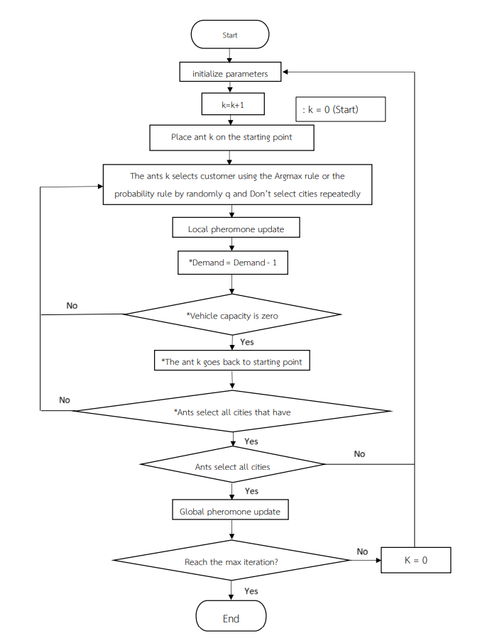

# DVRP-AntColony
# Ant Colony Algorithm for Dynamic Vehicel Rounting Problem

<ul>
  <li>AntColony.py --> The problem only number of orders from customers </li>
  <li>AntColonyWithTime.py --> Combine dynamic problems such as time of order from client and capacity of each delivery from each vehicle</li>
</ul>

- ProbLocate.py --> location of clients and time to travel client to client
- ProbOrder.py --> Demand from client and time that order coming
- Resource.py --> type of vehicle/ capacity of each vehicle 

- Gen Location.xlsx --> Example of generate Location of clients

